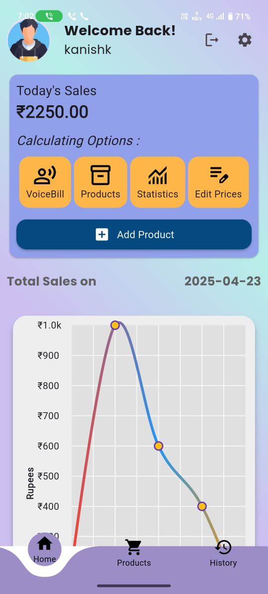
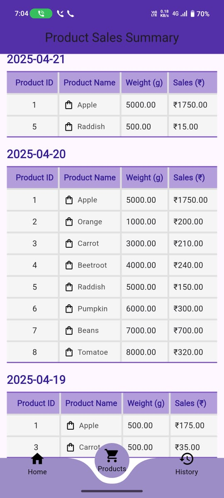
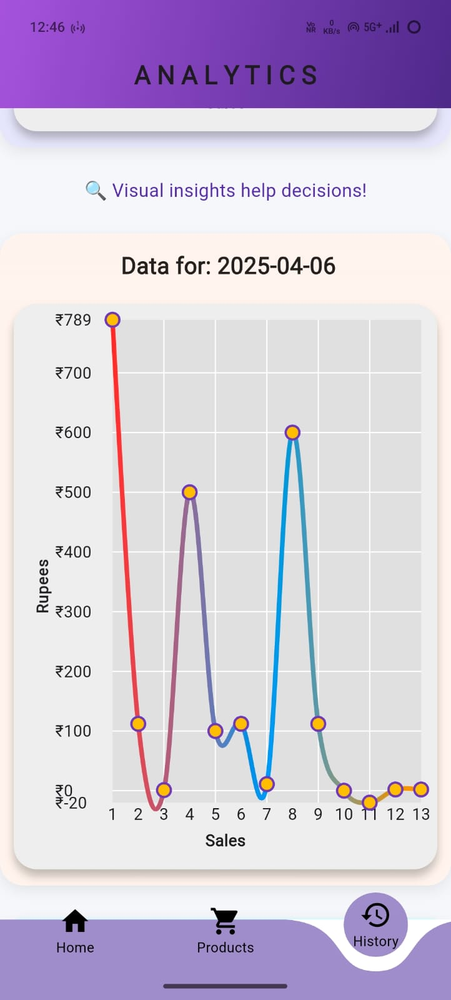
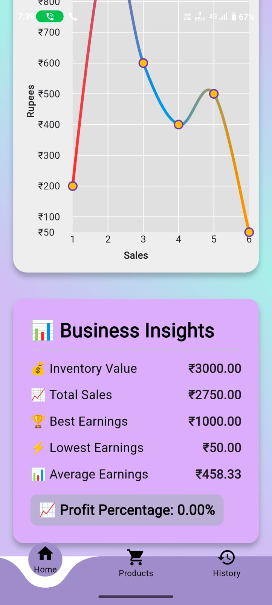
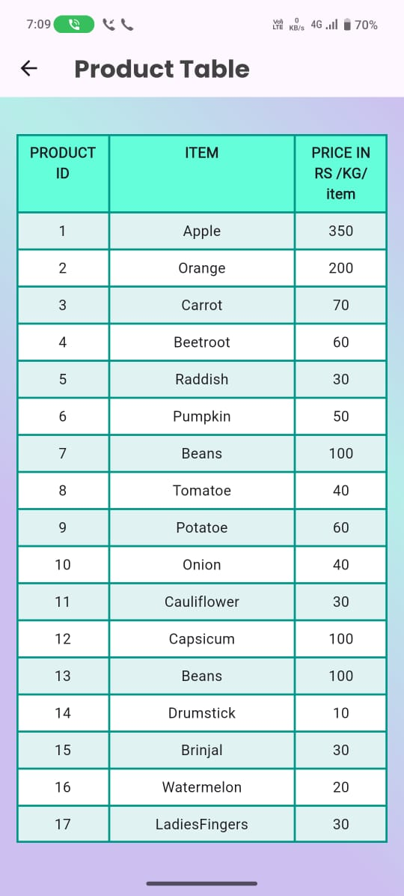
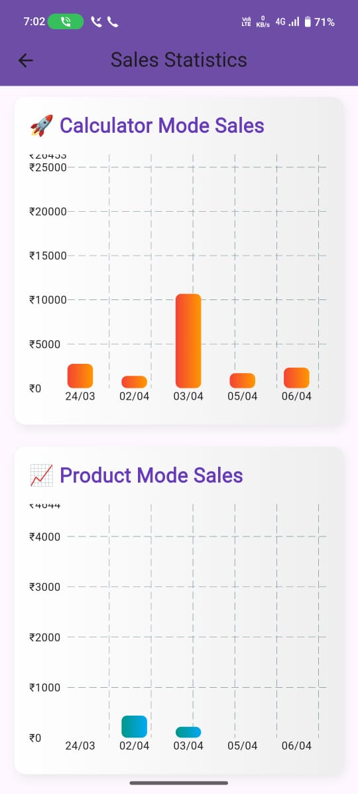

# Ecalibre - Smart Business Calculator 📊  

## Overview  
**Eclibre** is a powerful business calculator designed for vendors and SMEs to efficiently track inventory and calculate daily sales in a single touch without any hassle. It offers two modes:  
- **Product Mode**: Manage inventory and view product details.  
- **Calculator Mode**: Calculate and analyze sales data with clear visual representation.  

The app provides insightful **graphs** and allows users to view historical sales data, helping vendors optimize their business decisions.  

---

## Features 🚀  
✅ **Two Operation Modes** - Product Mode & Calculator Mode  
✅ **Voice Bill** - Prepares the bill based on Voice input 
✅ **Visual Sales Analytics** - Graphs for tracking trends  
✅ **Inventory Management** - Organize and track stock  
✅ **Historical Data Access** - View past sales records  
✅ **User-Friendly Interface** - Clear representation of data  

---

## Screenshots 🖼  
                                                  
<p align="center">
   
   
</p>

<p align="center">
   
   
</p>

<p align="center">
   
   
</p>

<p align="center">
   
   
</p>

---

## Installation 🔧  
To run the project locally:  

1. Clone the repository:  
   ```bash
   git clone https://github.com/YOUR_GITHUB_USERNAME/eclibre.git
2. Navigate to the project folder:
   ```bash
   cd eclibre
3. Install dependencies:
   ```bash
   flutter pub get
4. Run the app on an emulator or device:
   ```bash
   flutter run
---

## How to Use 📘
- Open the app and choose between Product Mode or Calculator Mode.
- In Product Mode, enter inventory details and track stock.
- In Calculator Mode, input sales data and view calculated reports.
- Access historical sales trends through interactive graphs.
- The app has a seperate page for the available products and the prices of the products can be changed and new product/items can also be added .
- The app has an unique feature of **VoiceBill** in which the product and the respective weight in grams has to be given as input for the number of products which prepares the bill .
- 
---

## Contact 📩
For inquiries or collaboration, reach out at kanishkp911@gmail.com or open an issue on GitHub.
